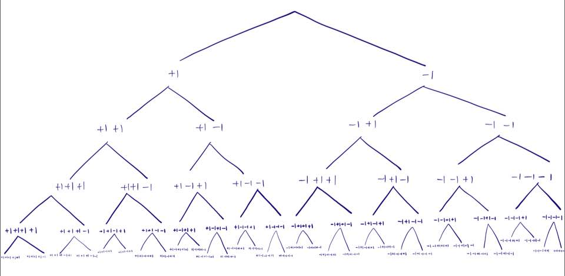

# 타겟 넘버 - 깊이 우선 탐색

## 아이디어

+ DFS 깊이우선탐색을 이용하여 풀어야 했다.
+ 스택으로도 풀이가 가능하지만 나는 재귀를 이용 하였다.
+ 배열에 있는 요소가 하나의 노드라면, 배열의 인덱스는 깊이이다.  

## 구현하기 
+ 아래와  같이 DFS를 실행하는 함수를 구현
~~~cpp
void DFS(vector<int> numbers, int target, int sum, int index){
    if(index == numbers.size()){        // numbers에 들어있는 숫자 갯수 만큼만 더해야.
        if(sum == target){      // 더한 것이 타겟과 같다면
            answer++;           // 만족하는거 하나 찾은거임
            return;
        }
        return;
    }
    DFS(numbers, target, sum + numbers.at(index), index + 1);       // 트리에서 깊이(index) +1 후 다음 노드(배열의 요소) +하기
    DFS(numbers, target, sum - numbers.at(index), index + 1);       // 트리에서 깊이(index) +1 후 다음 노드(배열의 요소) -하기
}
~~~

+ solution을 반환하는 함수
~~~cpp
int solution(vector<int> numbers, int target){

    DFS(numbers, target, 0,  0);    // numbers는 사용할 수들, target은 합쳐서 나올 수, sum은 현재 더해진 수, index는 현재 더한 갯수.

    return answer;
}
~~~

+ main 함수.
~~~cpp
int main() {
    vector<int> numbers = {1,1,1,1,1};
    int target = 3;
    int answer = solution(numbers, target);
    cout << "The answer is : "<< answer << endl;
    return 0;
}
~~~